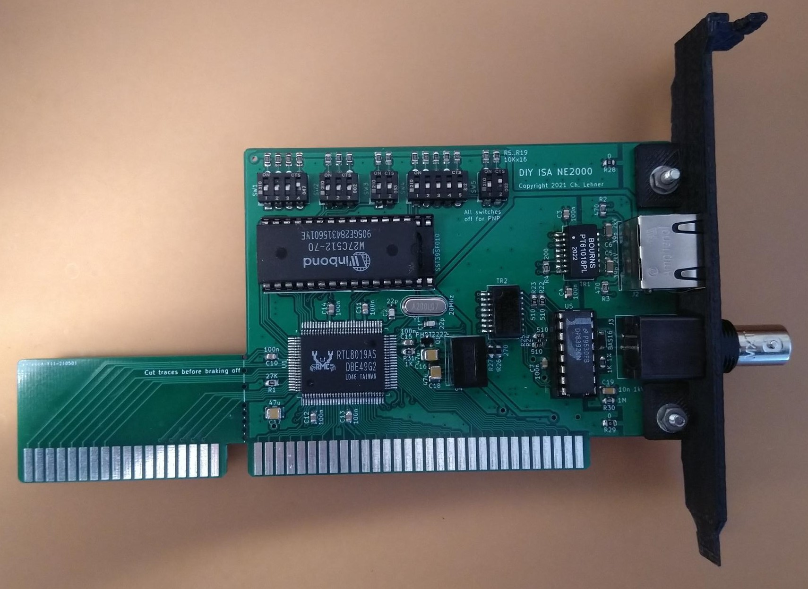
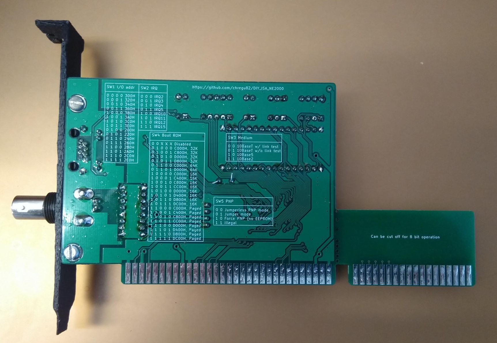

# DIY_ISA_NE2000
A build yourself ISA NE2000 compatible network card based on the Realtek RTL8019AS controller.

The PCB is designed to be usable as either an 8 bit or a 16 bit ISA card. If size matters, the 16 bit part can be broken off.
All components should be solderable by hand, although the RTL8019 chip is probably challenging. The smallest resistor or cap is in a 0805 case.
There are several hardware options:
- 10BaseT
- 10Base2
- Dip switch configuration (for pre-PNP computers)
- Boot ROM
## Hardware
### PCB
PCBs can be ordered from your favourite PCB supplier, e.g. JLCPCB or PCBway by using the provided [gerber files](https://github.com/chregu82/DIY_ISA_NE2000/blob/main/PCB/gerber/gerber.zip).
### General parts (use always)
Reference | Quantity | Description | Possible source
------------ | ------------- | -------------- | --------------
C1, C2 | 2 | Capacitor 22pF, 25V, 0805 | [Mouser](https://www.mouser.com/ProductDetail/80-C0805C220K3HACTU), [Reichelt](https://www.reichelt.com/smd-vielschicht-keramikkondensator-22p-5--npo-g0805-22p-p13517.html)
C8, C10-C15 | 7 | Capacitor 0.1uF, 50V, 0805 | [Mouser](https://www.mouser.com/ProductDetail/80-C0805C104M5R), [Reichelt](https://www.reichelt.com/vielschicht-kerko-100nf-50v-125-c-kem-x7r0805-100n-p207073.html)
C17 | 1 | Capacitor 47uF, 16V, 1210 | [Mouser](https://www.mouser.com/ProductDetail/81-GRM32EC81C476KE5L), [Reichelt](https://www.reichelt.com/vielschicht-kerko-47-f-16v-85-c-kem-x5r1210-47u-p207183.html)
R1 | 1 | Resistor 27K, 0805 | [Mouser](https://www.mouser.com/ProductDetail/652-CR0805FX-2702ELF), [Reichelt](https://www.reichelt.com/smd-widerstand-0805-27-kohm-125-mw-1--smd-0805-27-0k-p32903.html)
R28, R29 | 2 | Resistor 0 Ohm, 0805 | [Mouser](https://www.mouser.com/ProductDetail/603-RC0805JR-070RL), [Reichelt](https://www.reichelt.com/smd-widerstand-0805-0-0-ohm-125-mw-rnd-0805-1-0-p212707.html)
U1 | 1 | RTL8019AS | [Aliexpress](https://www.aliexpress.com), [Utsource](https://www.utsource.net/sch/rtl8019as.html), [Reichelt](https://www.reichelt.com/de/de/voll-duplex-ethernet-kontroller-plug-play-funktion-pqfp-100-rtl-8019as-p89309.html)
U2 | 1 | EEPROM 93C46, SOIC-8 | [Mouser](https://www.mouser.com/ProductDetail/556-A93C46DNSH-B), [Reichelt](https://www.reichelt.com/eeprom-seriell-1kb-128x8-64x16-2-5--5-v-so-8-m93c46-wmn6p-p280929.html)
Y1 | 1 | Crystal 20MHz, 18pF, HC49 | [Mouser](https://www.mouser.com/ProductDetail/815-ABL-20-B2), [Reichelt](https://www.reichelt.com/standardquarz-grundton-20-mhz-iqd-lfxtal003181-p245404.html)
### 10BaseT (RJ45)
Reference | Quantity | Description | Possible source
------------ | ------------- | -------------- | --------------
C3, C4 | 2 | Capacitor 0.1uF, 50V, 0805 | [Mouser](https://www.mouser.com/ProductDetail/80-C0805C104M5R), [Reichelt](https://www.reichelt.com/vielschicht-kerko-100nf-50v-125-c-kem-x7r0805-100n-p207073.html)
C5, C6 | 2 | Capacitor 39pF, 2kV, 1206 | [Mouser](https://www.mouser.com/ProductDetail/81-GRM31A7U3D390JW1D)
R2, R3 | 2 | Resistor 470 Ohm, 0805 | [Mouser](https://www.mouser.com/ProductDetail/652-CR0805FX-4700ELF)
R4 | 1 | Resistor 200 Ohm, 0805 | [Mouser](https://www.mouser.com/ProductDetail/652-CR0805FX-2000ELF)
J2 | 1 | RJ45 Connector | [Mouser](https://www.mouser.com/ProductDetail/523-RJHSE-5481)
TR1 | 1 | LAN transformer | [Mouser](https://www.mouser.com/ProductDetail/652-PT61017PEL)
### 10Base2 (BNC)
Reference | Quantity | Description | Possible source
------------ | ------------- | -------------- | --------------
C7 | 1 | Capacitor 0.1uF, 50V, 0805 | [Mouser](https://www.mouser.com/ProductDetail/80-C0805C104M5R), [Reichelt](https://www.reichelt.com/vielschicht-kerko-100nf-50v-125-c-kem-x7r0805-100n-p207073.html)
C19 | 1 | Capacitor 10nF, 1kV, 1206 | [Mouser](https://www.mouser.com/ProductDetail/710-885342208021), [Reichelt](https://www.reichelt.com/ch/de/smd-kerko-1206-10-nf-1000-v-10-mlcc-rnd-1501206b1033-p226057.html)
C16, C18 | 2 | Capacitor 47uF, 16V, 1210 | [Mouser](https://www.mouser.com/ProductDetail/81-GRM32EC81C476KE5L), [Reichelt](https://www.reichelt.com/vielschicht-kerko-47-f-16v-85-c-kem-x5r1210-47u-p207183.html)
D1 | 1 | Diode BAS16, SOD-123 | [Mouser](https://www.mouser.com/ProductDetail/841-BAS16GWJ), [Reichelt](https://www.reichelt.com/gleichrichterdiode-75-v-0-215-a-sot-23-bas-16-nxp-p219347.html)
J3 | 1 | BNC Connector | [Mouser](https://www.mouser.com/ProductDetail/538-73137-5003)
Q1 | 1 | Switching Transistor NPN 600mA, SOT-23 | [Mouser](https://www.mouser.com/ProductDetail/771-PMBT2222A-T-R), [Reichelt](https://www.reichelt.com/bipolartransistor-npn-40v-0-6a-0-33w-sot-23-smbt-2222a-inf-p219350.html)
R30 | 1 | Resistor 1M, 1/2W, 0805 | [Mouser](https://www.mouser.com/ProductDetail/652-CMP0805AFX-1004L)
R21, R31 | 2 | Resistor 1K, 1% , 0805 | [Mouser](https://www.mouser.com/ProductDetail/652-CR0805FX-1001ELF), [Reichelt](https://www.reichelt.com/ch/de/smd-widerstand-0805-1-0-kohm-125-mw-1--smd-0805-1-00k-p32886.html)
R22-R25 | 4 | Resistor 510 Ohm , 0805 | [Mouser](https://www.mouser.com/ProductDetail/603-RC0805JR-07510RL), [Reichelt](https://www.reichelt.com/ch/de/smd-widerstand-0805-510-ohm-330-mw-1--rnd-155hp05-di-p250803.html)
R26, R27 | 2 | Resistor 270 Ohm , 0805 | [Mouser](https://www.mouser.com/ProductDetail/71-CRCW0805270RJNEA)
TR2 | 1 | AUI Transformer | [Mouser](https://www.mouser.com/ProductDetail/673-PE-65728NL), [Mouser alternative](https://www.mouser.ch/ProductDetail/HALO-Electronics/TG01-1006NRL)
U4 | 1 | DC-DC Converter 12V to 9V, SIP4 | [Mouser](https://www.mouser.com/ProductDetail/209-IL1209S), [Alternative Mouser, expensive](https://www.mouser.com/ProductDetail/919-RI3-1209S)
U5 | 1 | BNC Transceiver DP8392CN, DIP16 | [Aliexpress](https://www.aliexpress.com), [Utsource](https://www.utsource.net/sch/dp8392cn.html)
### Dip switches (without PNP)
Reference | Quantity | Description | Possible source
------------ | ------------- | -------------- | --------------
R5-R19 | 16 | Resistor 10K , 0805 | [Mouser](https://www.mouser.com/ProductDetail/652-CR0805-JW-103ELF), [Reichelt](https://www.reichelt.com/smd-widerstand-0805-10-kohm-125-mw-1--rnd-0805-1-10k-p183251.html)
SW1 | 1 | Dip switch 4 pos | [Mouser](https://www.mouser.com/ProductDetail/774-2104MS), [Reichelt](https://www.reichelt.com/dip-schalter-liegend-4-polig-nt-04-p13532.html)
SW2 | 1 | Dip switch 3 pos | [Mouser](https://www.mouser.com/ProductDetail/774-2103MS), [Reichelt](https://www.reichelt.com/dip-schalter-liegend-3-polig-nt-03-p36465.html)
SW3, SW5 | 2 | Dip switch 2 pos | [Mouser](https://www.mouser.com/ProductDetail/774-2102MS), [Reichelt](https://www.reichelt.com/dip-schalter-liegend-2-polig-nt-02-p36464.html)
SW4 | 1 | Dip switch 5 pos | [Mouser](https://www.mouser.com/ProductDetail/774-2105MS), [Reichelt](https://www.reichelt.com/dip-schalter-liegend-5-polig-nt-05-p36466.html)
### Boot ROM
Reference | Quantity | Description | Possible source
------------ | ------------- | -------------- | --------------
C9 | 1 | Capacitor 0.1uF, 50V, 0805 | [Mouser](https://www.mouser.com/ProductDetail/80-C0805C104M5R), [Reichelt](https://www.reichelt.com/vielschicht-kerko-100nf-50v-125-c-kem-x7r0805-100n-p207073.html)
U3 | 1 | Socket DIP32, width 15.24mm | [Mouser](https://www.mouser.com/ProductDetail/649-DILB32P223TLF), [Reichelt](https://www.reichelt.com/ic-sockel-32-polig-doppelter-federkontakt-is25t1-332b-p268816.html)
U3 | 1 | Flash 1MBit DIP32 | [Mouser](https://www.mouser.com/ProductDetail/804-39SF010A7CPHE), [Reichelt](https://www.reichelt.com/multi-nor-flash-speicher-1-mb-128-k-x-8-5-v-dip-32-39sf01070-4c-p-p266393.html)
### ISA bracket
The mounting holes in the PCB are designed for the [Keystone 9202 Bracket](https://www.mouser.ch/ProductDetail/534-9202). Holes would have to be cut into the metal. There's no drawing yet.
I designed a 3D printable [ISA bracket](https://github.com/chregu82/DIY_ISA_NE2000/tree/main/Bracket) with holes for 10BaseT and 10Base2.
### 8 bit operation
For 8 bit computers, where size matters, the 16 bit part of the PCB can be broken off. However you have to make sure that the broken off traces don't connect to anything afterwards. It is probably a good idea to cut them before braking off the PCB part.
### Soldering tips
- Flux is probably of help
- You may want to use some kind of magnification
- Check if the pins made a solid connection
- Check for solder bridges
- Go from small to big
- Always check your power rails (at the big caps) for shorts before putting it in your computer
## Programming the EEPROM
Before the card can work in your system, the RTL8019 chip needs a valid initial configuration. This can be done with the DOS tool pg8019.exe.
- Download the files from the [tools directory](https://github.com/chregu82/DIY_ISA_NE2000/tree/main/Tools)
- Make sure address 0x300 is free
- Put the networking card in a free ISA slot
- Boot to DOS
- If you want, edit 8019as.cfg according to your needs (e.g. MAC address)
- Run pg8019.exe
- Turn off your PC

After the EEPROM is programmed you should be able to use the card. Some settings could still be altered with the tool Rset8019.exe.
## Drivers
[DOS packet driver for 8 bit operation](https://github.com/chregu82/DIY_ISA_NE2000/tree/main/Drivers/8%20bit%20packet%20driver)

[DOS packet driver for 16 bit operation](https://github.com/chregu82/DIY_ISA_NE2000/tree/main/Drivers/16%20bit%20packet%20driver)

[Other drivers directly from Realtek](https://www.realtek.com/en/component/zoo/category/rtl8019as-software)

